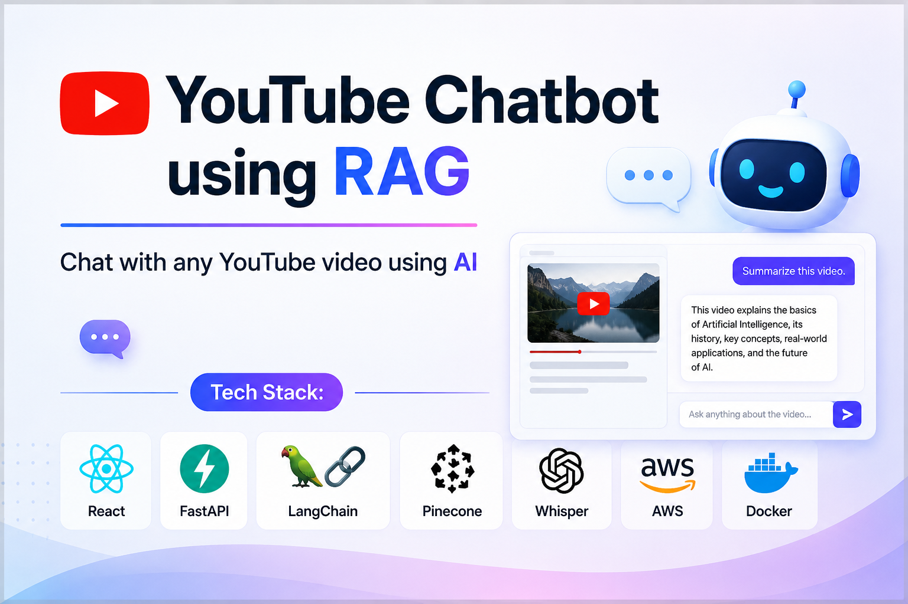
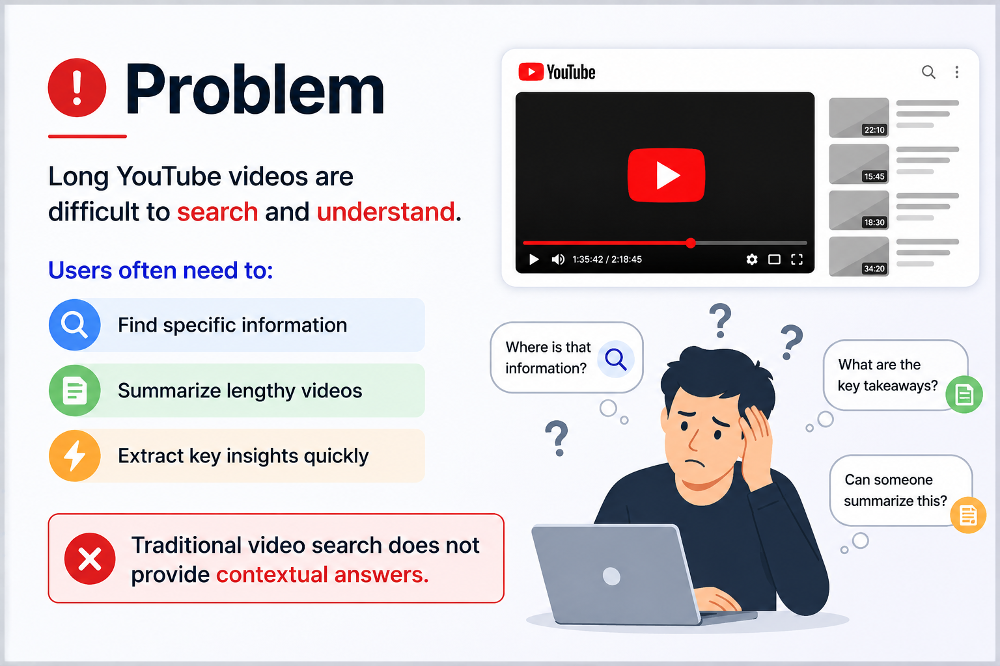
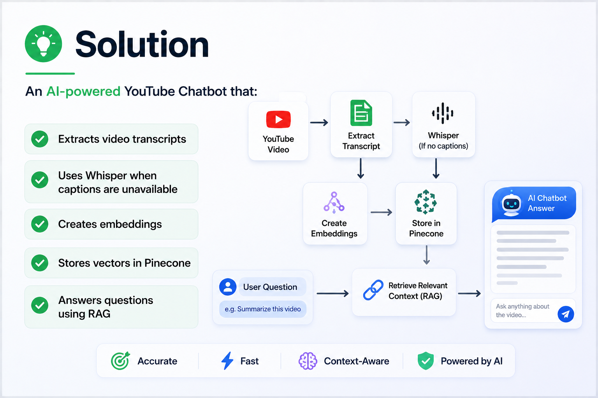
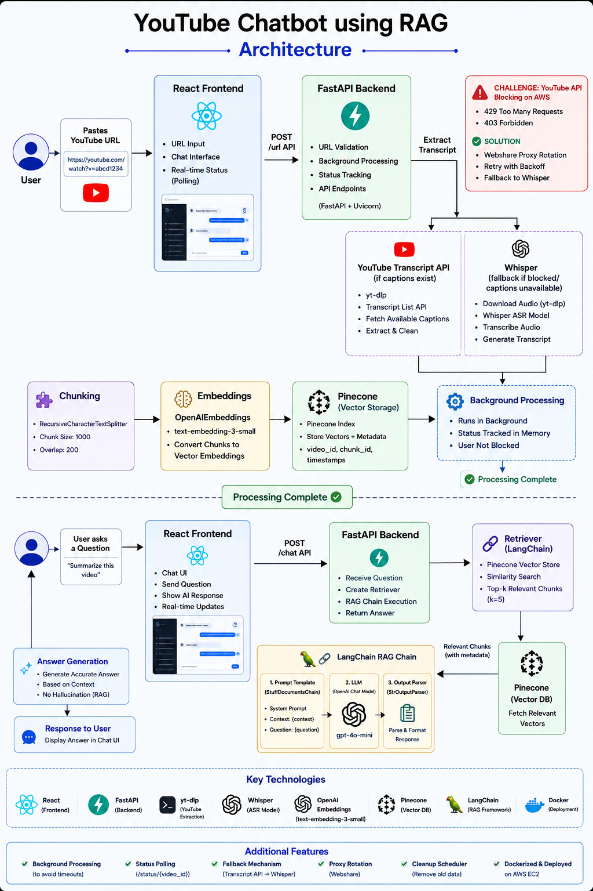
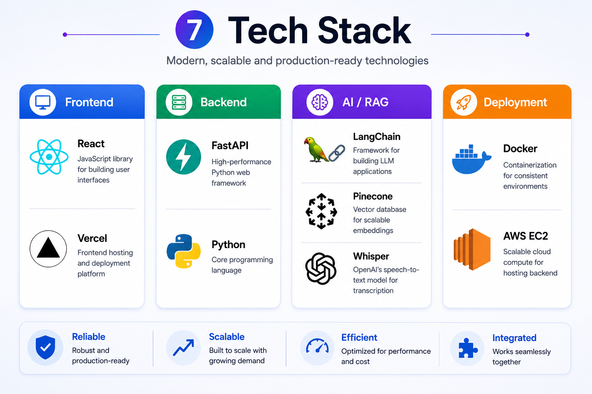
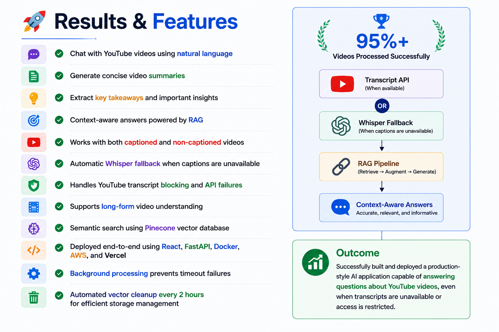
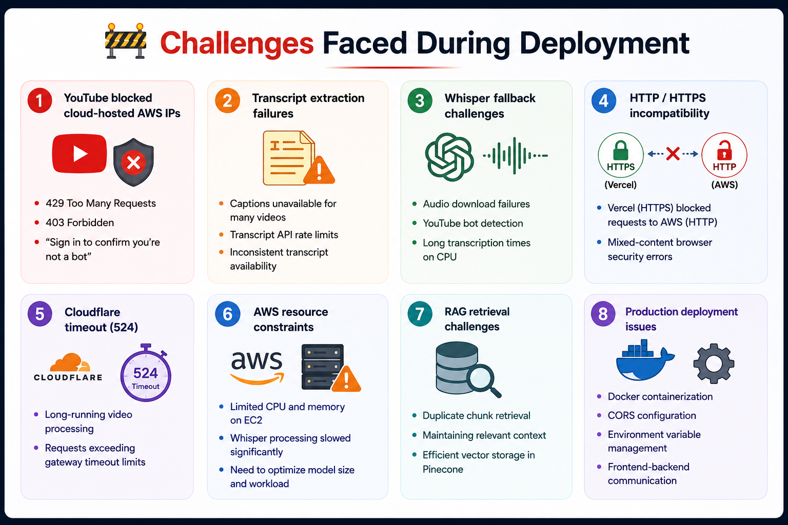
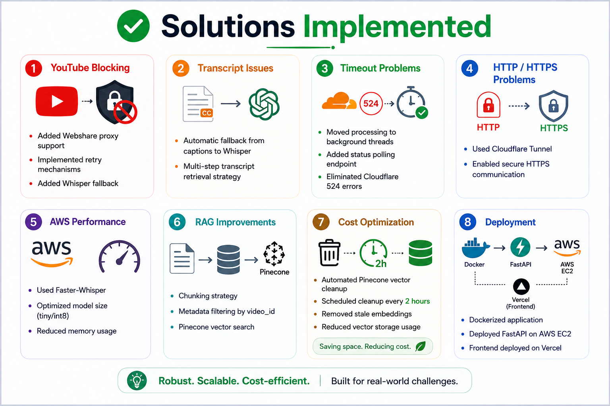
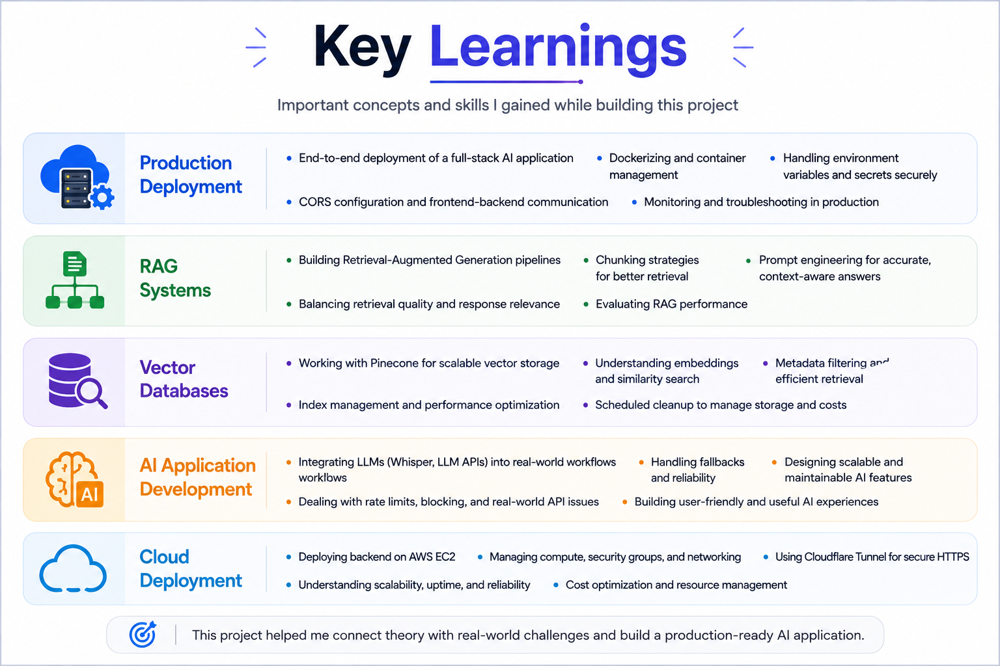

# 🎥 YouTube RAG Chatbot

<p align="center">
  
</p>

An AI-powered Retrieval-Augmented Generation (RAG) application that enables users to interact with YouTube videos using natural language.

Users can ask questions, generate summaries, and extract key insights from any YouTube video without watching the entire content.

---

# 📌 Problem Statement

<p align="center">
  
</p>

Many educational and long-form YouTube videos contain valuable information, but finding specific answers requires manually watching large portions of the video.

This project solves that problem by allowing users to directly chat with video content.

---

# 💡 Proposed Solution

<p align="center">
  
</p>

The system extracts video transcripts, converts them into vector embeddings, stores them in Pinecone, and retrieves relevant context to answer user questions accurately.

---

# 🏗️ System Architecture

<p align="center">
  
</p>

### Workflow

1. User submits a YouTube URL
2. Transcript extraction
3. Whisper fallback (if captions unavailable)
4. Chunking and preprocessing
5. Embedding generation
6. Pinecone vector storage
7. Retrieval of relevant chunks
8. LLM response generation

---

# 🛠️ Tech Stack

<p align="center">
  
</p>

### Frontend

* React
* Vite
* Axios

### Backend

* FastAPI
* Python

### AI & RAG

* LangChain
* Pinecone
* OpenRouter
* OpenAI Embeddings
* Faster Whisper

### Deployment

* Docker
* AWS EC2

---

# 🚀 Features & Results

<p align="center">
  
</p>

### Features

✅ Chat with YouTube videos using natural language

✅ Generate concise summaries

✅ Extract key insights and takeaways

✅ Context-aware answers powered by RAG

✅ Pinecone vector search

✅ Whisper fallback support

### Results

* Accurate transcript-based responses
* Fast semantic retrieval
* Support for captioned and non-captioned videos
* End-to-end RAG pipeline deployment

---

# ⚠️ Challenges Faced

<p align="center">
  
</p>

### Major Challenges

* YouTube transcript blocking on cloud providers
* Long Whisper processing times
* Vector database management
* Deployment and Docker configuration
* Transcript availability issues

---

# ✅ Challenge Solutions

<p align="center">
  
</p>

Implemented fallback mechanisms, optimized retrieval workflows, improved deployment strategy, and added transcript handling logic to improve reliability.

---

# 📚 Key Learnings

<p align="center">
  
</p>

* Retrieval-Augmented Generation (RAG)
* LangChain Pipelines
* Vector Databases
* Prompt Engineering
* FastAPI Development
* Docker Deployment
* AWS Deployment
* AI Application Development

---

# 🎬 Demo Video

### Watch Project Demonstration

[▶ Watch Demo Video](YOUR_YOUTUBE_VIDEO_LINK)

---

# 📂 Repository Structure

```text
youtube-rag-chatbot/
│
├── frontend/
├── backend/
├── assets/
└── README.md
```

---

# ⚙️ Installation

## Backend

```bash
cd backend
pip install -r requirements.txt
uvicorn main:app --reload
```

## Frontend

```bash
cd frontend
npm install
npm run dev
```

---

# 🔮 Future Improvements

* Multi-video chat support
* User authentication
* Chat history
* Better transcript retrieval
* Multi-language support

---

# 👨‍💻 Author

**Pranav Landge**

BE Information Technology (SPPU)

Generative AI | RAG | LangChain | FastAPI | React | Docker | AWS
